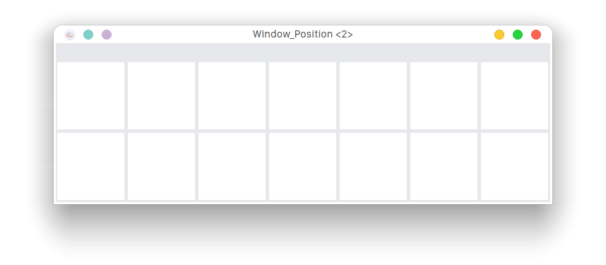
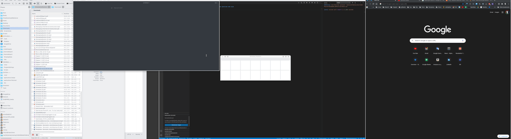

# Window Grid Position
This is very handy if you have a big screen.

# Linux - Use a grid, to move windows position and size

- This is first relase, its still in beta

---

---

# Installation:
sudo apt-get install python3-tk xdotool
